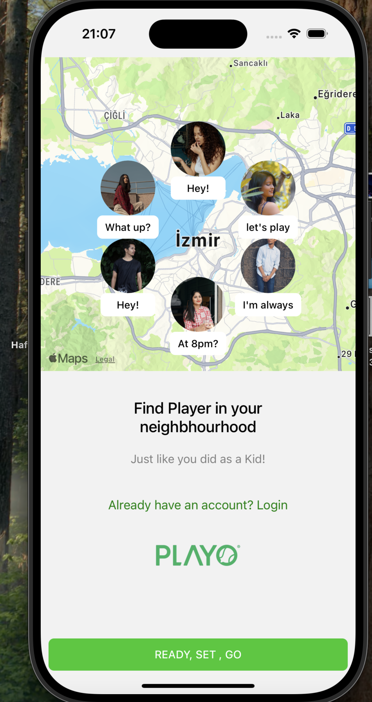

# MERN Stack Sports Center & Sports Buddy App

A full-stack mobile application developed with the MERN stack that allows users to find sports centers and connect with sports buddies. Built with React Native for Android and iOS.

## Features
- User authentication with JWT
- Find and book sports centers
- Connect with sports buddies
- Real-time chat functionality
- Google Maps integration for location-based services
- Profile management with image upload
- Schedule and join sports events

## Tech Stack

### Frontend
- **React Native** (Mobile development)
- **@react-navigation/native** (Navigation)
- **react-native-maps** (Google Maps integration)
- **axios** (API communication)
- **@react-native-async-storage/async-storage** (Storage management)
- **react-native-image-picker** (Profile image upload)
- **react-native-vector-icons** (Icons)
- **moment** (Date handling)

### Backend
- **Node.js** (Backend runtime)
- **Express.js** (Server framework)
- **MongoDB & Mongoose** (Database and ODM)
- **jsonwebtoken (JWT)** (User authentication)
- **body-parser** (Request parsing)
- **cors** (Cross-Origin Resource Sharing)
- **nodemailer** (Email notifications)

### Development Tools
- **TypeScript** (Static typing)
- **ESLint & Prettier** (Code linting and formatting)
- **Jest** (Testing framework)
- **Nodemon** (Auto-restarting server)

## Installation

### Prerequisites
- Node.js (>=18)
- MongoDB installed
- React Native CLI set up

### Setup
1. Clone the repository:
   ```sh
   git clone https://github.com/yourusername/sports-app.git
   cd sports-app

## Screenshots
  